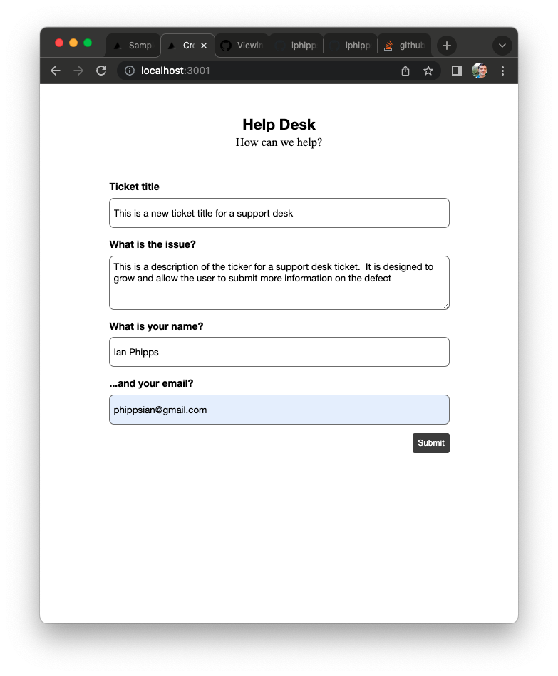
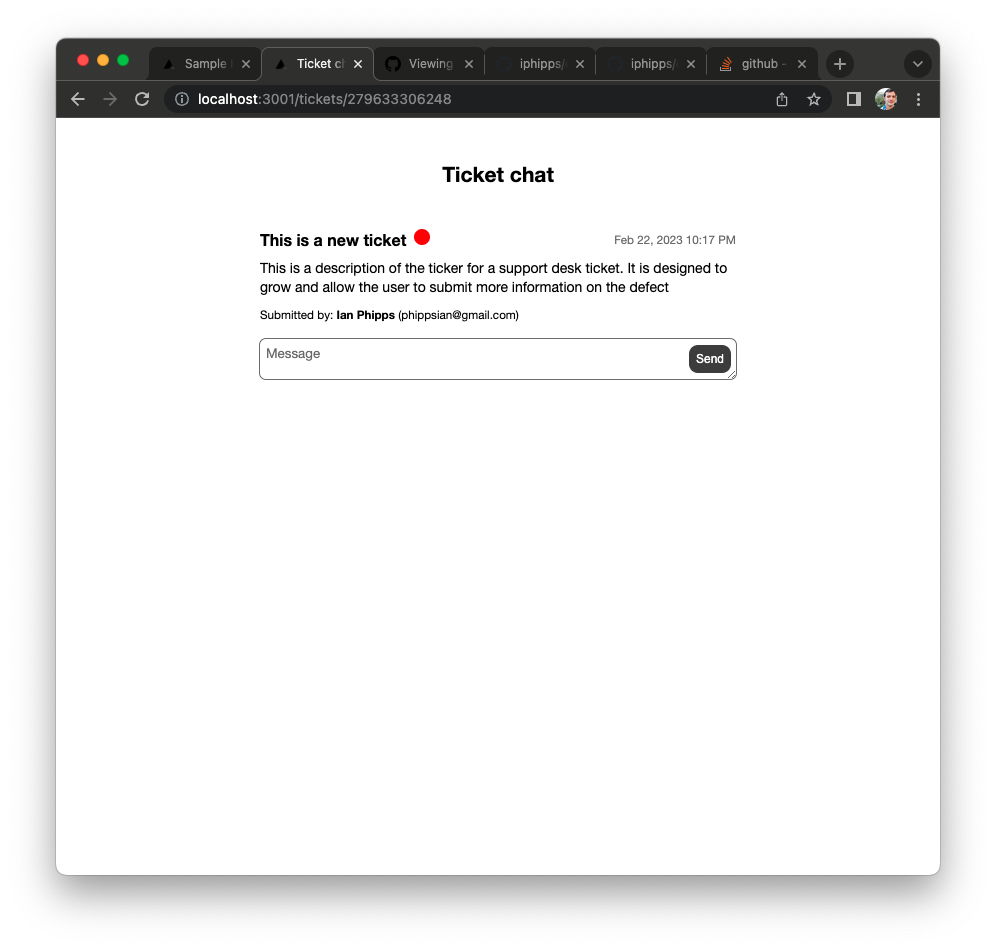
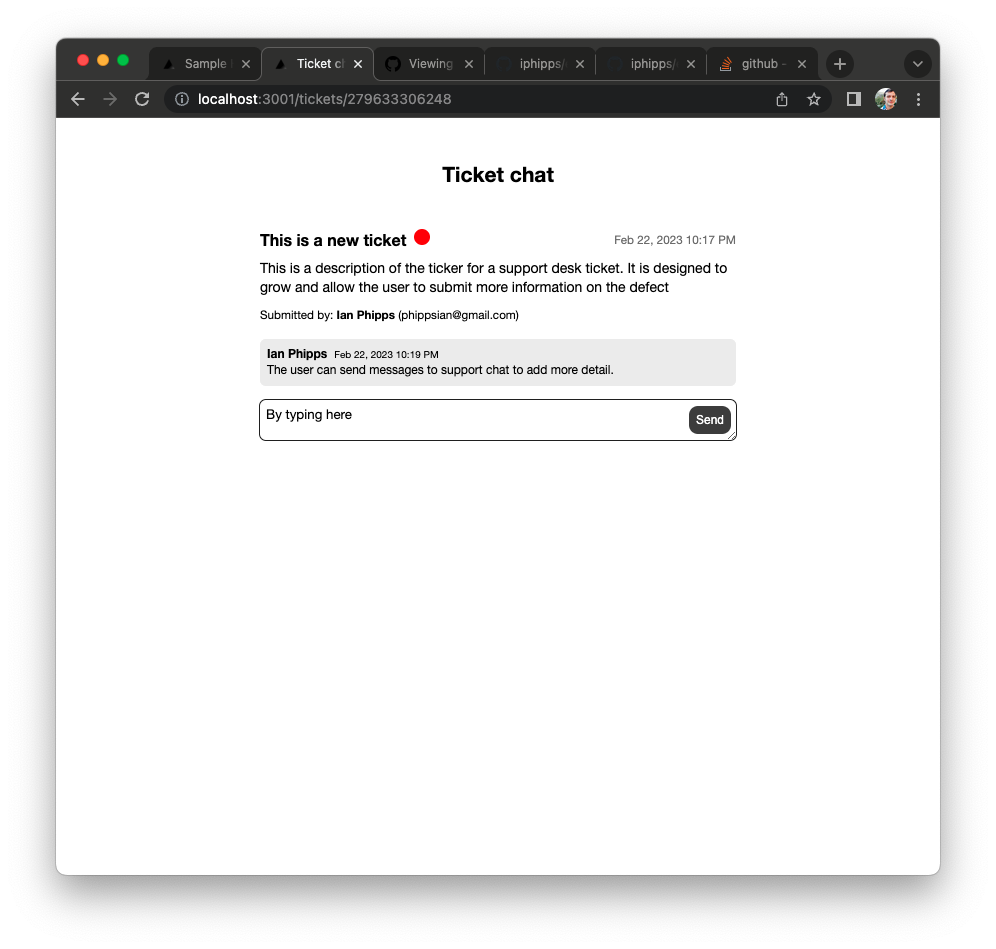
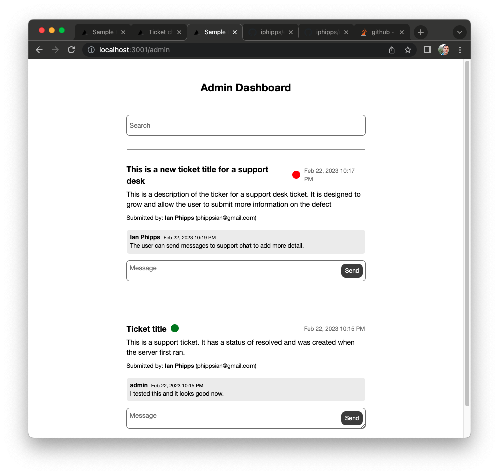
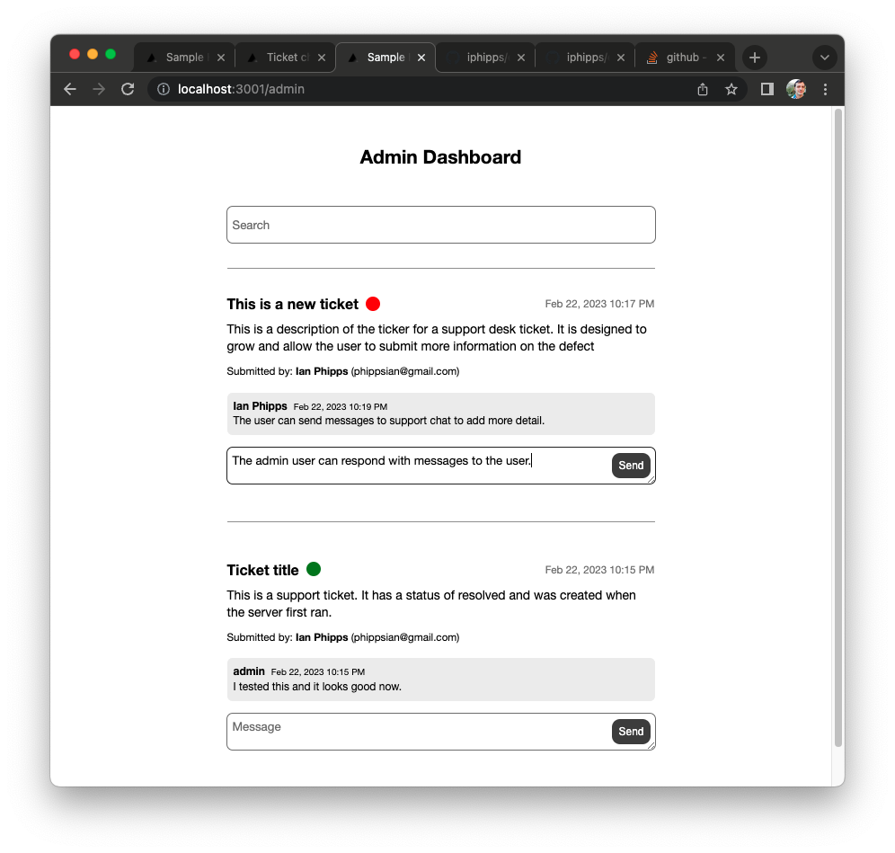
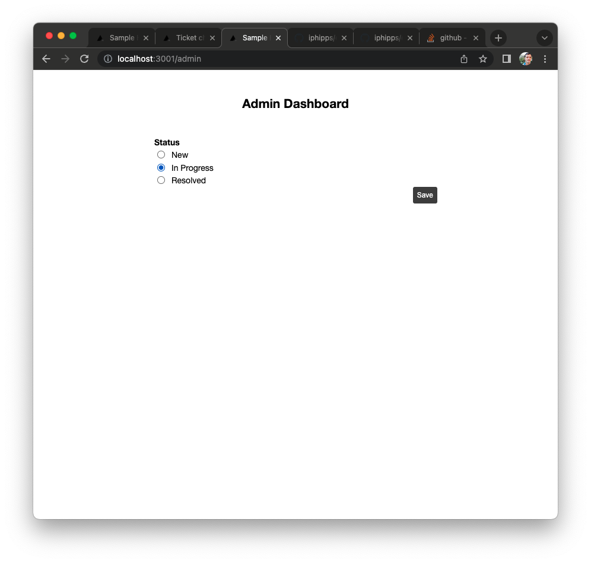
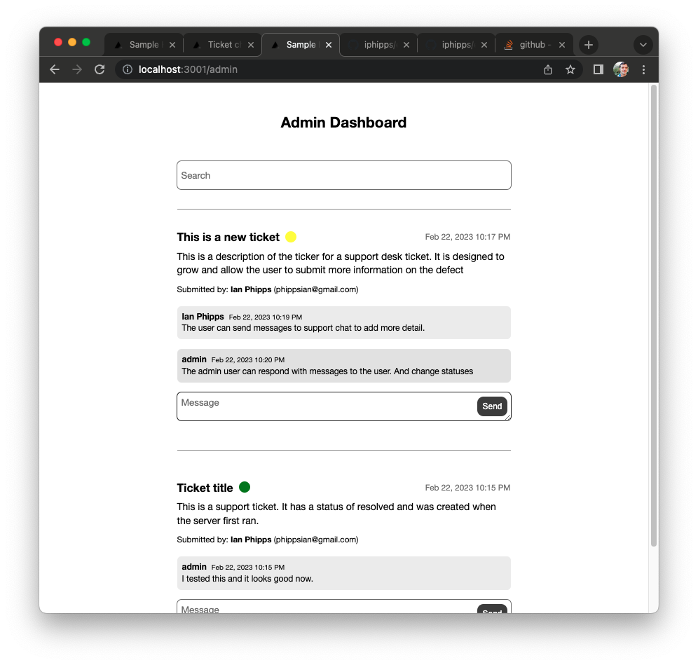

# Introduction

This repo represents a coding challenge for a role I was considering. As you can tell, it is a bit in depth.  The challenge involved two prompts:
1. To create a help desk / support system ticket management system which is the code in this repository.
2. Team leading. How would you lead a team? What methodology would you follow, at what cadence? Who would be writing product spec and tickets? How would you collaborate with product / design? How would you deliver bad feedback.  I address these questions in [DEVELOPING.md](./DEVELOPING.md).

In the end, this gig was not a match, but it was a fun exercise regardless.

# Run the app

This is a yarn packages mono repo with a [server directory](./server) that runs nestJS and a [client directory](./client) that runs Next.js.


Install all npm dependencies

```
yarn
```

Run the server

```
yarn server run start
```

Run the client

```
yarn client run dev
```

Navigate to `http://localhost:3001`.

# Screenshots











# Next steps

This was quick poc / discovery style development. There is a lot to do in order for this to be production ready. The code has some TODOs which could be associated with tickets. On a high level, here's what I feel would be next steps for this repository.

On the backend:

1. Adding an orm and database. [nest docs look promising](https://docs.nestjs.com/techniques/database).
2. Add auth -- [nest has some useful opinions on auth](https://docs.nestjs.com/security/authentication)
3. More tests

On the frontend:

1. Add a data/state manager for reducing duplicated code and being able to listen to events and update state. Maybe redux(?)
2. Add a design system.
3. Respect backend auth/roles. Currently, this has useful screens for public/private roles, e.g. `/admin` vs `/[ticketId]` vs `/` . But the experience should be more curated and secured by role.
4. More tests

Infra stuff:

1. Environments and corresponding env variables (local, dev, staging, prod)
2. A release tagging system that the team likes and knows how to use
3. CI -- linting and testing
4. A tsconfig that better enforces congruence between back and front end.
5. Linting

# On process

See the document [developing code as a team](./DEVELOPING.md)
